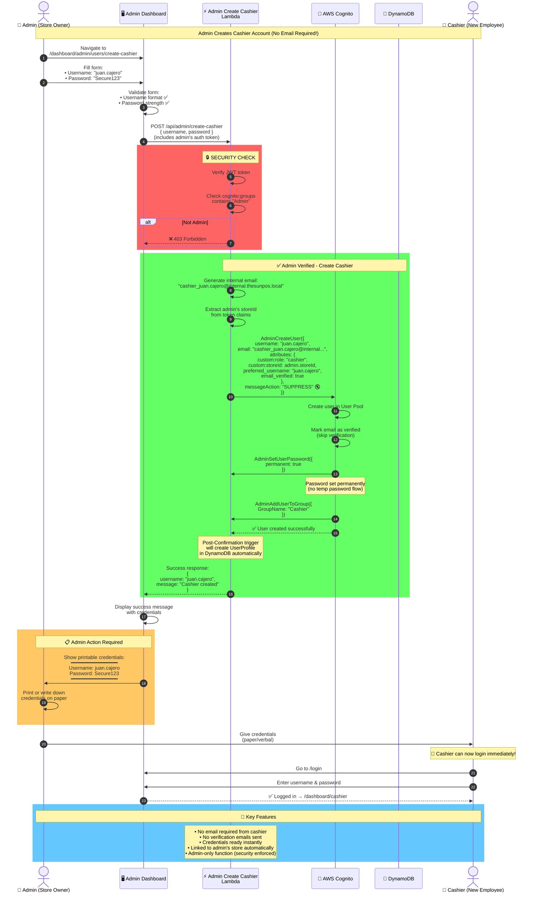

# Admin Create Cashier Lambda - Flow Diagram

Copy this into [Mermaid Live Editor](https://mermaid.live/) to visualize.



## The Problem This Solves

### Why Cashiers Don't Have Email
- 👷 Many retail/restaurant workers don't have email addresses
- 📱 They may not want to share personal email for work
- ⚡ Onboarding needs to be instant (no waiting for verification)
- 🔐 Admins need full control over access

### Why This Needs a Lambda Function

**Cannot be done from frontend because:**
1. ❌ Frontend cannot suppress Cognito emails
2. ❌ Frontend cannot set `email_verified = true`
3. ❌ Frontend cannot use `AdminCreateUser` (admin-only AWS API)
4. ❌ Security: Must verify caller is actually an admin

**Lambda function enables:**
1. ✅ Generate internal email format (never exposed to user)
2. ✅ Skip email verification step
3. ✅ Set permanent password (no temp password flow)
4. ✅ Suppress all email notifications
5. ✅ Enforce admin-only access via token validation

## User Flow Comparison

### Traditional Flow (Won't Work for Us)
```
Cashier provides email → Receives verification email →
Clicks link → Verifies email → Can login
❌ Problem: Cashiers don't have email!
```

### Our Flow (With This Lambda)
```
Admin creates account → Gives credentials to cashier →
Cashier logs in immediately
✅ Solution: No email needed!
```

## Security Features

1. **Admin Verification**: Checks `cognito:groups` contains "Admin"
2. **Token Validation**: Verifies JWT signature from Cognito
3. **Store Isolation**: Cashier automatically linked to admin's store
4. **No Email Exposure**: Internal email never shown in UI
5. **Audit Trail**: CloudWatch logs all cashier creations

## What Happens Behind the Scenes

```typescript
// 1. Lambda generates internal email
const internalEmail = `cashier_${username}@internal.thesunpos.local`;

// 2. Creates user with custom attributes
await cognito.adminCreateUser({
  UserPoolId: process.env.USER_POOL_ID,
  Username: username,
  UserAttributes: [
    { Name: 'email', Value: internalEmail },
    { Name: 'email_verified', Value: 'true' }, // Skip verification
    { Name: 'preferred_username', Value: username },
    { Name: 'custom:role', Value: 'cashier' },
    { Name: 'custom:storeId', Value: adminStoreId }, // From admin's token
  ],
  MessageAction: 'SUPPRESS', // Don't send emails!
});

// 3. Set permanent password (no temp password)
await cognito.adminSetUserPassword({
  UserPoolId: process.env.USER_POOL_ID,
  Username: username,
  Password: password,
  Permanent: true,
});

// 4. Add to Cashier group
await cognito.adminAddUserToGroup({
  UserPoolId: process.env.USER_POOL_ID,
  Username: username,
  GroupName: 'Cashier',
});
```

## Result

✅ Cashier can login immediately with username + password
✅ No email verification needed
✅ Admin maintains full control
✅ Multi-tenant isolation enforced
✅ Secure and compliant with AWS best practices
