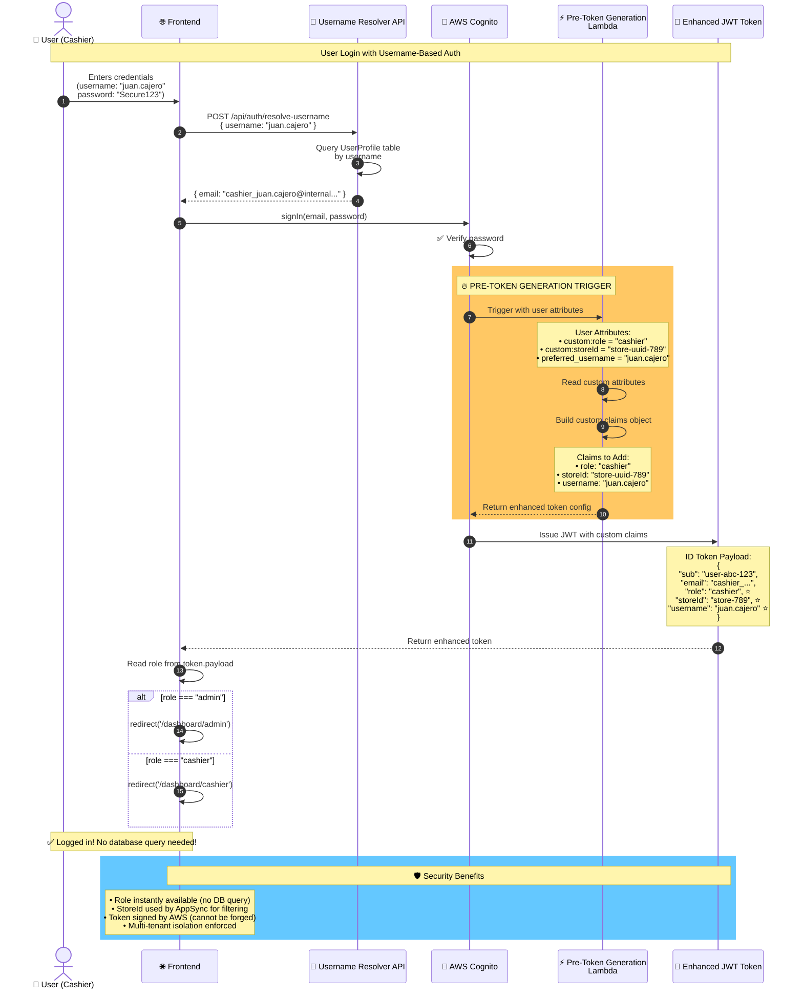

# Pre-Token Generation Lambda - Flow Diagram

Copy this into [Mermaid Live Editor](https://mermaid.live/) to visualize.



## Key Points

### What Gets Added to Token
- **role**: "admin" or "cashier" → Used for UI routing and permissions
- **storeId**: UUID → Used for multi-tenant data isolation
- **username**: Display name → Shown in UI (not internal email)

### Why This Matters
1. **Performance**: No database query on every page load
2. **Security**: AppSync uses storeId from token to filter data
3. **UX**: Instant role-based redirects
4. **Multi-tenancy**: Automatic data isolation per store

### Without This Function
```typescript
// ❌ Every page load:
const user = await getCurrentUser();
const profile = await fetchUserProfile(user.sub); // Extra API call!
const role = profile.role;
```

### With This Function
```typescript
// ✅ Instant:
const session = await fetchAuthSession();
const role = session.tokens?.idToken?.payload.role; // Already in token!
```
