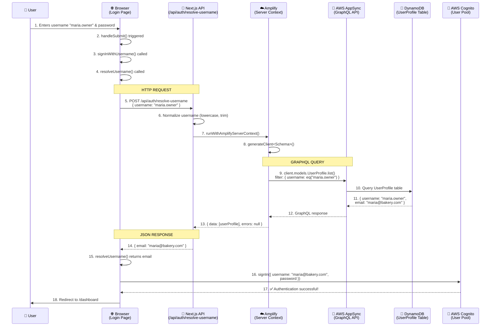

# Username Authentication Flow Diagram

## Visual Flow



## Step-by-Step Breakdown

### 🌐 BROWSER (Client-Side)
| Step | Function | Description |
|------|----------|-------------|
| 1 | User Input | User enters username and password in login form |
| 2 | `handleSubmit()` | Form submission handler triggered |
| 3 | `signInWithUsername()` | Custom auth function called |
| 4 | `resolveUsername()` | Initiates username → email resolution |
| 5 | `fetch()` | HTTP POST to `/api/auth/resolve-username` |

**File:** `src/app/login/page.tsx`, `src/lib/amplify/auth-helpers.ts`

---

### 🔧 SERVER (Next.js API Route)
| Step | Function | Description |
|------|----------|-------------|
| 6 | Normalize | Convert username to lowercase, trim whitespace |
| 7 | `runWithAmplifyServerContext()` | Create isolated Amplify context for this request |
| 8 | `generateClient()` | Create GraphQL client with User Pool auth |
| 9 | `UserProfile.list()` | Query UserProfile table by username |

**File:** `src/app/api/auth/resolve-username/route.ts`

---

### ☁️ AWS CLOUD
| Step | Service | Description |
|------|---------|-------------|
| 10 | AppSync | Receives GraphQL query from Amplify client |
| 11 | DynamoDB | Queries UserProfile table with username filter |
| 12 | AppSync | Returns user data: `{ username, email, role, storeId }` |
| 13 | Response | Flows back through Amplify → API → Browser |

**AWS Services:** AppSync GraphQL API, DynamoDB

---

### 🔐 AUTHENTICATION COMPLETION
| Step | Function | Description |
|------|----------|-------------|
| 14 | API Response | Returns `{ email: "maria@bakery.com" }` |
| 15 | `resolveUsername()` | Extracts email from response |
| 16 | `signIn()` | Calls Cognito with email (not username!) |
| 17 | Cognito | Validates credentials, returns tokens |
| 18 | Redirect | User redirected to dashboard |

---

## Why This Flow Exists

### The Problem
- **Cognito** requires **email** for authentication
- **Our users** (especially cashiers) use **usernames** (no emails)

### The Solution
- **Frontend:** Users see username-based login ✅
- **Backend:** We translate username → email before calling Cognito
- **Cognito:** Receives email as expected ✅

---

## Key Files

```
src/
├── app/
│   ├── login/page.tsx                    # Login form (triggers flow)
│   └── api/auth/resolve-username/
│       └── route.ts                      # Username → Email API
├── lib/amplify/
│   ├── auth-helpers.ts                   # signInWithUsername(), resolveUsername()
│   └── server.ts                         # runWithAmplifyServerContext()
└── amplify/
    └── data/resource.ts                  # UserProfile schema
```

---

## Data Flow Example

### Admin Login
```
Input:  username="maria.owner", password="SecurePass123"
         ↓
Query:  UserProfile.list({ filter: { username: { eq: "maria.owner" } } })
         ↓
Result: { email: "maria@bakery.com", role: "admin" }
         ↓
Cognito: signIn({ username: "maria@bakery.com", password: "SecurePass123" })
         ↓
Output: ✅ Logged in, redirect to /dashboard/admin
```

### Cashier Login
```
Input:  username="juan.cajero", password="MyPass456"
         ↓
Query:  UserProfile.list({ filter: { username: { eq: "juan.cajero" } } })
         ↓
Result: { email: "cashier_juan.cajero@internal.thesunpos.local", role: "cashier" }
         ↓
Cognito: signIn({ username: "cashier_juan.cajero@internal.thesunpos.local", password: "MyPass456" })
         ↓
Output: ✅ Logged in, redirect to /dashboard/cashier
```

---

## Security Notes

1. **Username Resolution API** is public (pre-authentication)
2. **Rate limiting** recommended for production (prevents brute-force)
3. **Server-side context** isolates each request (prevents data leakage)
4. **Internal emails** never exposed to users (cashiers)

---

Generated: 2026-06-25
Project: The Sun Pos
Flow Type: Username-Based Authentication with Cognito
